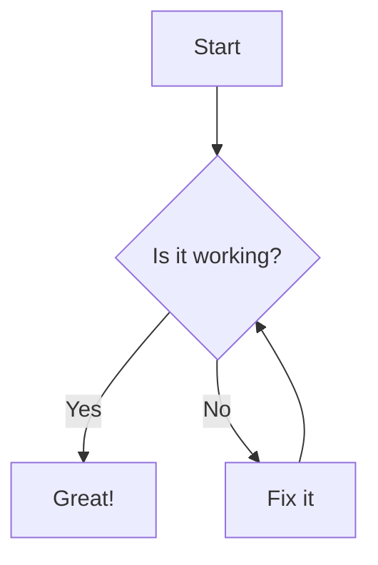
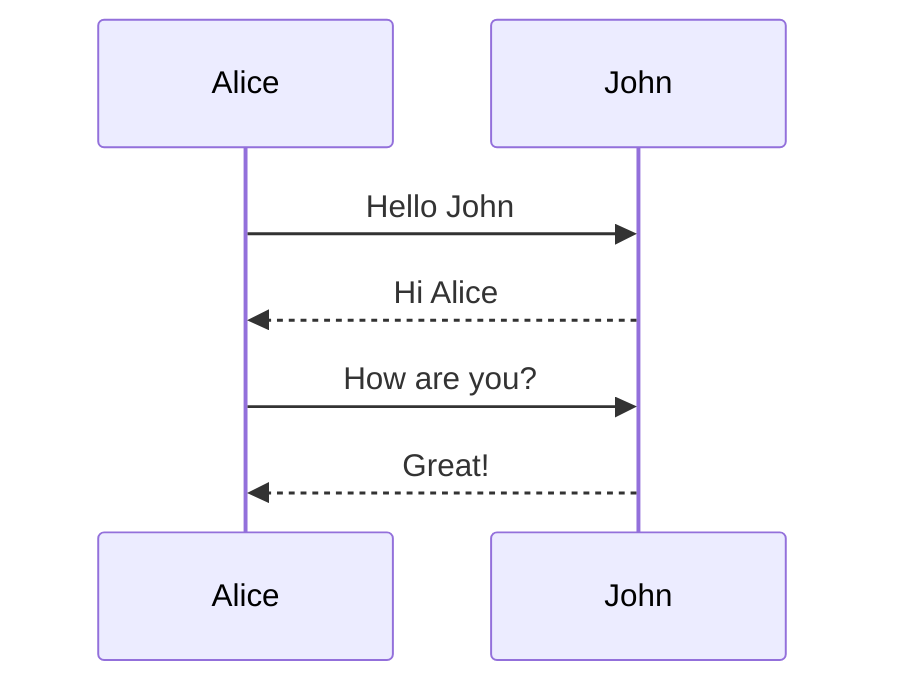
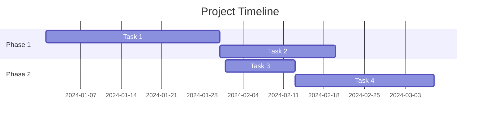

# Moremaid

A powerful Markdown viewer with full Mermaid diagram support. View your markdown files with beautifully rendered diagrams, syntax-highlighted code blocks, and a clean reading experience.

## 🤖 About This Project

**This entire project was coded by Claude (Anthropic's AI assistant), not by a human developer.** Every line of code, feature implementation, and architectural decision was created through AI-human collaboration. The human provided requirements and feedback, while Claude handled all the actual programming, debugging, and problem-solving.

## 🔐 Secure Document Sharing with --pack

Share sensitive documentation securely with Moremaid's encrypted archive feature:

```bash
# Pack your markdown files into an encrypted ZIP
mm --pack docs/

# Set a password when prompted
# Share the encrypted .zip file

# Recipients can browse without extraction
mm packed.zip
```

**Key Benefits:**
- 📦 **Pack & Encrypt** - Bundle markdown files into password-protected ZIP archives
- 🌐 **Browse Without Extraction** - View encrypted content directly in browser, no temp files
- 🔒 **In-Memory Decryption** - Files stay encrypted on disk, decrypted only when viewed
- 🚀 **Zero Installation for Recipients** - Anyone with the password can view via `npx moremaid packed.zip`

Perfect for sharing confidential documentation, technical specs, or sensitive notes while maintaining security.

## Features

- 🎨 **Mermaid Diagram Rendering** - Full support for flowcharts, sequence diagrams, Gantt charts, and more
- 🖥️ **Syntax Highlighting** - Code blocks with syntax highlighting for 20+ languages via Prism.js
- 🎭 **10 Color Themes** - Choose from Light, Dark, GitHub, Dracula, Nord, Solarized, Monokai, and more
- 🌙 **Smart Theme UI** - Theme selector appears on hover in top-right corner
- 📁 **Server Mode** - Browse directories or view single files with built-in HTTP server
- 📦 **Archive Support** - Pack and share markdown projects as `.moremaid` files with optional encryption
- 🔍 **Full-Text Search** - Search within file contents with context snippets and highlighting
- ⌨️ **Keyboard Navigation** - Use TAB to toggle search modes, arrow keys to navigate results
- 🎯 **Smart Search** - Fuzzy matching, prefix search, and relevance ranking
- 📱 **Responsive Design** - Clean, readable layout that works on any screen size
- 🔗 **Bookmarkable URLs** - Direct links to specific files (server mode)
- 🖼️ **Fullscreen Diagrams** - Click to open Mermaid diagrams in a new window
- 🧹 **Auto-Cleanup** - Server automatically closes when browser disconnects (use `--keep-running` to keep server running)
- 🚀 **Zero Config** - Works out of the box with sensible defaults

## Installation

### Command-Line Tool

#### Option 1: Global Installation
```bash
npm install -g moremaid
mm your-file.md
```

#### Option 2: Local Installation
```bash
git clone https://github.com/yourusername/moremaid.git
cd moremaid
npm install
./mm.js your-file.md
```

#### Option 3: Using npx (no installation)
```bash
npx moremaid your-file.md
```

## Usage

### Command-Line Tool (Single File)

View any markdown file in your browser with a live server:

```bash
mm README.md                   # Starts server for single file
mm docs/api-documentation.md
mm ~/notes/meeting-notes.md

# With theme selection
mm README.md --theme github
mm file.md -t dracula
mm file.md --dark              # Shortcut for --theme dark

# Legacy mode: generate temp HTML and exit
mm README.md --oneshot
mm file.md -o
```

### Archive Mode (.moremaid Files)

Pack and share your markdown projects:

```bash
# Pack a directory into a .moremaid archive
mm --pack myproject/
mm --pack README.md            # Pack a single file
mm --pack docs/ --theme github # Pack with default theme

# View a .moremaid archive
mm project.moremaid             # Opens archive in browser
mm shared.zip                   # Also supports regular .zip files
```

Archive features:
- **Password Protection** - Optional AES-256 encryption for sensitive documents
- **Self-Contained** - All markdown files packed into a single shareable file
- **Auto-Cleanup** - Server automatically shuts down when browser closes (default behavior)
- **Instant Navigation** - Single WebSocket connection for all files

Available command-line options:
```bash
mm [options] <markdown-file-or-folder-or-archive>

Options:
  -h, --help          Show help message
  -v, --version       Show version number
  -d, --dark          Start in dark mode (shortcut for --theme dark)
  -t, --theme <name>  Select color theme:
                      light, dark, github, github-dark, dracula,
                      nord, solarized-light, solarized-dark,
                      monokai, one-dark
  -p, --pack          Pack files into .moremaid archive
  -k, --keep-running  Keep server running after browser closes
  -o, --oneshot       Generate temp HTML and exit (legacy single-file mode)
```

Single file mode features:
- Starts local server for live viewing
- Auto-cleanup when browser closes (use `--keep-running` to disable)
- Direct file view with no index page
- Supports theme selection via command-line flags
- Legacy temp file mode available with `--oneshot`

### Folder Mode (Directory Browser)

Browse all markdown files in a directory with a built-in server:

```bash
mm .                    # Current directory
mm docs                 # Specific folder
mm ~/projects/docs      # Any folder path
mm . --keep-running     # Keep server running after browser closes
PORT=3000 mm samples    # Custom port
```

Folder mode features:
- Starts local HTTP server (automatically finds free port)
- Recursively finds all markdown files
- Interactive index page with file navigation
- **Full-text search** across all markdown files
- **Context snippets** showing text around matches
- **Keyboard shortcuts** for efficient navigation
- **Auto-cleanup** - Server closes when browser disconnects (unless --keep-running is used)
- Click files to view them with full rendering
- Back navigation on file pages
- Graceful shutdown with Ctrl+C

#### Search Features

When in folder mode, you can:
- **Search filenames** - Default mode, searches in file and folder names
- **Search contents** - Toggle with checkbox or TAB key to search within files
- **View snippets** - See context around matches with highlighting
- **Navigate results** - Use arrow keys to browse, Enter to open

Keyboard shortcuts:
- `/` - Focus search field
- `TAB` - Toggle between filename/content search (when focused)
- `↑↓` - Navigate search results
- `Enter` - Open selected file
- `ESC` - Clear search and unfocus
- `Ctrl/Cmd + Click` or `Middle Click` - Open file in new tab/window
- `Shift + Click` - Open file in new tab/window

## Color Themes

Moremaid includes 10 beautiful color themes:

- **Light** - Clean, bright theme for daytime reading
- **Dark** - Easy on the eyes for night-time viewing
- **GitHub** - Familiar GitHub markdown styling
- **GitHub Dark** - GitHub's dark mode theme
- **Dracula** - Popular dark theme with vibrant colors
- **Nord** - Arctic, north-bluish color palette
- **Solarized Light/Dark** - Precision colors for machines and people
- **Monokai** - Classic developer theme
- **One Dark** - Atom's iconic dark theme

Themes can be:
- Selected via command-line: `mm file.md --theme dracula`
- Changed interactively by hovering over the top-right corner
- Persisted in browser's localStorage
- System preference aware (uses dark mode if system prefers it)

## Mermaid Diagram Support

Moremaid renders all types of Mermaid diagrams:

### Flowchart


### Sequence Diagram


### Gantt Chart


Click the ⛶ button on any diagram to open it fullscreen in a new window.

All diagrams automatically adapt to your selected color theme for consistent styling.

## Syntax Highlighting

Code blocks are automatically highlighted with support for:

- JavaScript/TypeScript
- Python
- Java, C++, C#
- Go, Rust, Swift
- Ruby, PHP
- SQL, YAML, JSON
- Docker, Shell scripts
- And many more...

Example:
```python
def hello_world():
    print("Hello, Moremaid!")
    return True
```

## Project Structure

```
moremaid/
├── mm.js              # CLI tool entry point
├── package.json       # NPM package configuration
├── samples/           # Example markdown files
└── README.md          # This file
```

## Requirements

### CLI Tool
- Node.js 14.0.0 or higher
- NPM (comes with Node.js)

### Browser Support
- Any modern browser (Chrome, Firefox, Safari, Edge)
- JavaScript must be enabled

## How It Works

### CLI Tool (Single File)
1. Creates a single-file virtual file system
2. Starts a local HTTP server
3. Automatically redirects to the file view
4. Renders markdown with Mermaid diagrams
5. Auto-cleanup when browser disconnects (default)
6. Use `--oneshot` for legacy temp file mode

### CLI Tool (Folder Mode)
1. Scans directory recursively for markdown files
2. Starts HTTP server on available port
3. Generates index page with file listing
4. Serves markdown files on demand
5. Renders with same quality as single-file mode
6. Handles navigation between files

## Development

### Building from Source

```bash
# Clone the repository
git clone https://github.com/yourusername/moremaid.git
cd moremaid

# Install dependencies
npm install

# Run locally
./mm.js test.md

# Run tests (when available)
npm test
```

### Contributing

Contributions are welcome! Please feel free to submit a Pull Request.

1. Fork the repository
2. Create your feature branch (`git checkout -b feature/AmazingFeature`)
3. Commit your changes (`git commit -m 'Add some AmazingFeature'`)
4. Push to the branch (`git push origin feature/AmazingFeature`)
5. Open a Pull Request

## License

MIT License - see LICENSE file for details

## Comparison with Alternatives

| Feature | Moremaid | GitHub | VSCode | Typora |
|---------|----------|---------|---------|---------|
| Mermaid Support | ✅ Full | ✅ Full | ⚠️ Extension | ✅ Full |
| Color Themes | ✅ 10+ | ✅ 2 | ✅ Many | ✅ Several |
| Full-Text Search | ✅ Yes | ✅ Limited | ✅ Yes | ✅ Yes |
| Context Snippets | ✅ Yes | ❌ No | ✅ Yes | ❌ No |
| Offline Usage | ✅ Yes | ❌ No | ✅ Yes | ✅ Yes |
| CLI Tool | ✅ Yes | ❌ No | ❌ No | ❌ No |
| Web Server | ✅ Yes | ❌ N/A | ⚠️ Extension | ❌ No |
| Free | ✅ Yes | ✅ Yes | ✅ Yes | ❌ Paid |
| Bookmarkable | ✅ Yes | ✅ Yes | ❌ No | ❌ No |
| No Installation* | ✅ Yes | ✅ Yes | ❌ No | ❌ No |

\* For viewing markdown files using npx

## Troubleshooting

### CLI Tool Issues

**Error: "mm: command not found"**
- Make sure you've installed globally with `npm install -g`
- Or use `npx moremaid` instead
- Or run directly with `./mm.js`

**Browser doesn't open automatically**
- The HTML file is saved to your temp directory
- Look for the path in any error message
- Open the file manually if needed

### Server Issues

**Port already in use**
- The folder mode automatically finds an available port
- Use `PORT=3000 mm .` to specify a custom port

### Rendering Issues

**Mermaid diagrams not rendering**
- Ensure JavaScript is enabled in your browser
- Check browser console for any error messages
- Try refreshing the page

**Code highlighting not working**
- Some language aliases might not be recognized
- Try using the full language name (e.g., `javascript` instead of `js`)

## Acknowledgments

- [Marked](https://marked.js.org/) - Markdown parser and compiler
- [Mermaid](https://mermaid-js.github.io/) - Diagram and flowchart generator
- [Prism.js](https://prismjs.com/) - Syntax highlighter

## Support

For bugs, questions, and discussions please use the [GitHub Issues](https://github.com/yourusername/moremaid/issues).

---

Made with ❤️ for the Markdown community