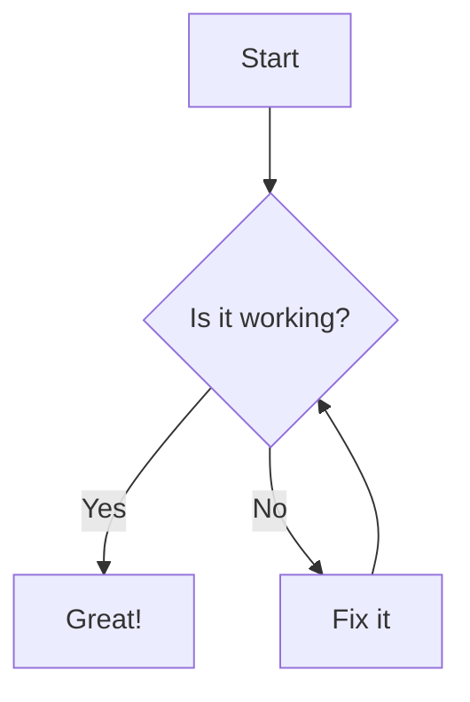
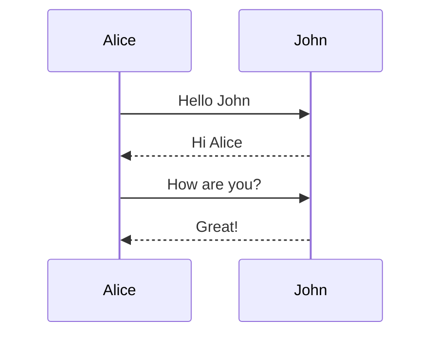
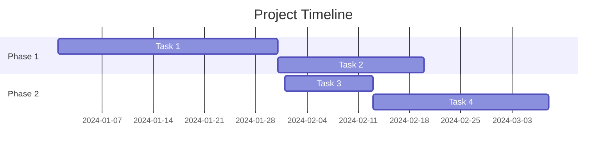

# Moremaid

A powerful Markdown viewer with full Mermaid diagram support. View your markdown files with beautifully rendered diagrams, syntax-highlighted code blocks, and a clean reading experience - either via command-line or web interface.

## Features

- 🎨 **Mermaid Diagram Rendering** - Full support for flowcharts, sequence diagrams, Gantt charts, and more
- 🖥️ **Syntax Highlighting** - Code blocks with syntax highlighting for 20+ languages via Prism.js
- 📁 **Folder Mode** - Browse entire directories of markdown files with built-in HTTP server
- 🔍 **Smart Port Selection** - Automatically finds available port when default is busy
- 📱 **Responsive Design** - Clean, readable layout that works on any screen size
- 🔗 **Bookmarkable URLs** - Direct links to specific files (server mode)
- 🖼️ **Fullscreen Diagrams** - Click to open Mermaid diagrams in a new window
- 🚀 **Zero Config** - Works out of the box with sensible defaults

## Installation

### Command-Line Tool

#### Option 1: Global Installation
```bash
npm install -g moremaid
mm your-file.md
```

#### Option 2: Local Installation
```bash
git clone https://github.com/yourusername/moremaid.git
cd moremaid
npm install
./mm.js your-file.md
```

#### Option 3: Using npx (no installation)
```bash
npx moremaid your-file.md
```

### Python Server

No installation needed - uses Python standard library only:

```bash
git clone https://github.com/yourusername/moremaid.git
cd moremaid/python
python server.py
```

## Usage

### Command-Line Tool (Single File)

Convert any markdown file to HTML and open it in your browser:

```bash
mm README.md
mm docs/api-documentation.md
mm ~/notes/meeting-notes.md
```

The tool:
- Generates a standalone HTML file with all assets embedded
- Opens it in your default browser automatically
- Cleans up the temporary file after viewing

### Folder Mode (Directory Browser)

Browse all markdown files in a directory with a built-in server:

```bash
mm .                    # Current directory
mm docs                 # Specific folder
mm ~/projects/docs      # Any folder path
PORT=3000 mm samples    # Custom port
```

Folder mode features:
- Starts local HTTP server (automatically finds free port)
- Recursively finds all markdown files
- Interactive index page with file navigation
- Click files to view them with full rendering
- Back navigation on file pages
- Graceful shutdown with Ctrl+C

### Python Web Server

Start the server to browse all markdown files in a directory:

```bash
cd your-markdown-directory
python path/to/moremaid/python/server.py
```

Then open http://localhost:8000 in your browser.

Features:
- File tree navigation in sidebar
- Click any `.md` file to view it
- Bookmark specific files with URLs like `http://localhost:8000#docs/guide.md`
- Navigate through your entire markdown documentation

## Mermaid Diagram Support

Moremaid renders all types of Mermaid diagrams:

### Flowchart


### Sequence Diagram


### Gantt Chart


Click the ⛶ button on any diagram to open it fullscreen in a new window.

## Syntax Highlighting

Code blocks are automatically highlighted with support for:

- JavaScript/TypeScript
- Python
- Java, C++, C#
- Go, Rust, Swift
- Ruby, PHP
- SQL, YAML, JSON
- Docker, Shell scripts
- And many more...

Example:
```python
def hello_world():
    print("Hello, Moremaid!")
    return True
```

## Project Structure

```
moremaid/
├── mm.js              # CLI tool entry point
├── package.json       # NPM package configuration
├── python/
│   ├── server.py      # Python HTTP server
│   ├── index.html     # Web interface
│   └── README.md      # Server documentation
├── samples/           # Example markdown files
└── README.md          # This file
```

## Requirements

### CLI Tool
- Node.js 14.0.0 or higher
- NPM (comes with Node.js)

### Python Server
- Python 3.x
- No additional packages required

### Browser Support
- Any modern browser (Chrome, Firefox, Safari, Edge)
- JavaScript must be enabled

## How It Works

### CLI Tool (Single File)
1. Reads the markdown file
2. Converts to HTML using `marked` library
3. Processes Mermaid code blocks
4. Embeds all CSS and JavaScript inline
5. Creates a temporary HTML file
6. Opens it in your default browser
7. Cleans up after 5 seconds

### CLI Tool (Folder Mode)
1. Scans directory recursively for markdown files
2. Starts HTTP server on available port
3. Generates index page with file listing
4. Serves markdown files on demand
5. Renders with same quality as single-file mode
6. Handles navigation between files

### Python Web Server
1. Scans directory for markdown files
2. Provides REST API endpoints
3. Serves single-page application
4. Renders markdown on-demand
5. Maintains navigation state via URL hash

## Development

### Building from Source

```bash
# Clone the repository
git clone https://github.com/yourusername/moremaid.git
cd moremaid

# Install dependencies
npm install

# Run locally
./mm.js test.md

# Run tests (when available)
npm test
```

### Contributing

Contributions are welcome! Please feel free to submit a Pull Request.

1. Fork the repository
2. Create your feature branch (`git checkout -b feature/AmazingFeature`)
3. Commit your changes (`git commit -m 'Add some AmazingFeature'`)
4. Push to the branch (`git push origin feature/AmazingFeature`)
5. Open a Pull Request

## License

MIT License - see LICENSE file for details

## Comparison with Alternatives

| Feature | Moremaid | GitHub | VSCode | Typora |
|---------|----------|---------|---------|---------|
| Mermaid Support | ✅ Full | ✅ Full | ⚠️ Extension | ✅ Full |
| Offline Usage | ✅ Yes | ❌ No | ✅ Yes | ✅ Yes |
| CLI Tool | ✅ Yes | ❌ No | ❌ No | ❌ No |
| Web Server | ✅ Yes | ❌ N/A | ⚠️ Extension | ❌ No |
| Free | ✅ Yes | ✅ Yes | ✅ Yes | ❌ Paid |
| Bookmarkable | ✅ Yes | ✅ Yes | ❌ No | ❌ No |
| No Installation* | ✅ Yes** | ✅ Yes | ❌ No | ❌ No |

\* For viewing markdown files
\** Python server requires no installation beyond Python itself

## Troubleshooting

### CLI Tool Issues

**Error: "mm: command not found"**
- Make sure you've installed globally with `npm install -g`
- Or use `npx moremaid` instead
- Or run directly with `./mm.js`

**Browser doesn't open automatically**
- The HTML file is saved to your temp directory
- Look for the path in any error message
- Open the file manually if needed

### Server Issues

**Port 8000 already in use**
- Another service is using port 8000
- Stop the other service or modify `server.py` to use a different port

**No files showing in sidebar**
- Make sure you're running the server from a directory containing `.md` files
- Check that Python has read permissions for the directory

### Rendering Issues

**Mermaid diagrams not rendering**
- Ensure JavaScript is enabled in your browser
- Check browser console for any error messages
- Try refreshing the page

**Code highlighting not working**
- Some language aliases might not be recognized
- Try using the full language name (e.g., `javascript` instead of `js`)

## Acknowledgments

- [Marked](https://marked.js.org/) - Markdown parser and compiler
- [Mermaid](https://mermaid-js.github.io/) - Diagram and flowchart generator
- [Prism.js](https://prismjs.com/) - Syntax highlighter

## Support

For bugs, questions, and discussions please use the [GitHub Issues](https://github.com/yourusername/moremaid/issues).

---

Made with ❤️ for the Markdown community