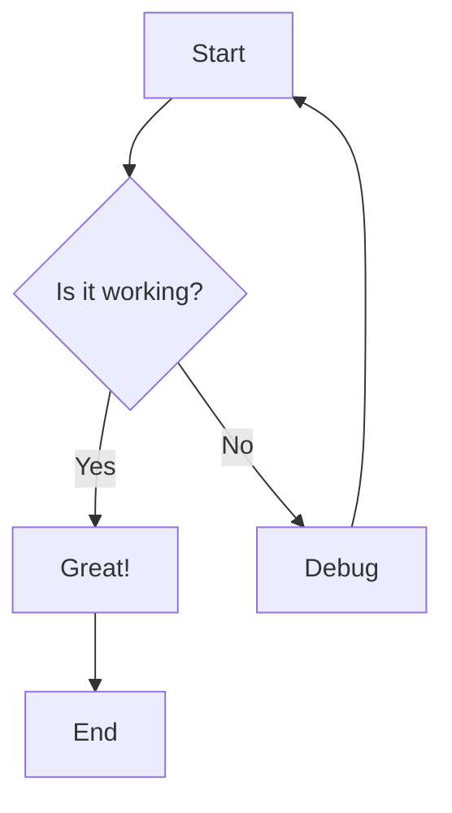

# Syntax Highlighting Test

This document demonstrates syntax highlighting for various programming languages.

## JavaScript

```javascript
// Function to calculate fibonacci
function fibonacci(n) {
    if (n <= 1) return n;
    return fibonacci(n - 1) + fibonacci(n - 2);
}

const result = fibonacci(10);
console.log(`Fibonacci of 10 is: ${result}`);
```

## Python

```python
# Python implementation
def fibonacci(n):
    """Calculate fibonacci number recursively"""
    if n <= 1:
        return n
    return fibonacci(n - 1) + fibonacci(n - 2)

result = fibonacci(10)
print(f"Fibonacci of 10 is: {result}")
```

## SQL

```sql
-- Create users table
CREATE TABLE users (
    id INTEGER PRIMARY KEY AUTOINCREMENT,
    username VARCHAR(50) NOT NULL UNIQUE,
    email VARCHAR(100) NOT NULL,
    created_at TIMESTAMP DEFAULT CURRENT_TIMESTAMP
);

-- Query active users
SELECT username, email
FROM users
WHERE active = 1
ORDER BY created_at DESC;
```

## Bash

```bash
#!/bin/bash

# Backup script
BACKUP_DIR="/backup/$(date +%Y%m%d)"
SOURCE_DIR="/var/www"

echo "Starting backup..."
mkdir -p "$BACKUP_DIR"
rsync -av "$SOURCE_DIR" "$BACKUP_DIR"
echo "Backup completed!"
```

## JSON

```json
{
    "name": "Sample Project",
    "version": "1.0.0",
    "dependencies": {
        "express": "^4.18.0",
        "mongoose": "^7.0.0"
    },
    "scripts": {
        "start": "node server.js",
        "dev": "nodemon server.js"
    }
}
```

## YAML

```yaml
apiVersion: apps/v1
kind: Deployment
metadata:
  name: nginx-deployment
spec:
  replicas: 3
  selector:
    matchLabels:
      app: nginx
  template:
    metadata:
      labels:
        app: nginx
    spec:
      containers:
      - name: nginx
        image: nginx:latest
        ports:
        - containerPort: 80
```

## Mermaid Diagram



## Plain Text (No Language Specified)

```
This is plain text without syntax highlighting.
It should appear with basic formatting.
No colors or special highlighting here.
```

## Inline Code

You can also use inline code like `const x = 10;` or `print("Hello")` within paragraphs.