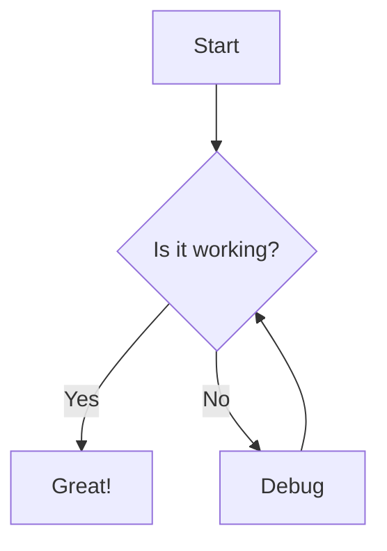

# Test Markdown File

This is a test of the **moremaid** command-line tool.

## Features

- Syntax highlighting for code
- Mermaid diagram support
- No server required

## Code Example

```javascript
function greet(name) {
    console.log(`Hello, ${name}!`);
}
```

## Mermaid Diagram



## Table

| Feature | Supported |
|---------|-----------|
| Markdown | ✓ |
| Mermaid | ✓ |
| Syntax Highlighting | ✓ |